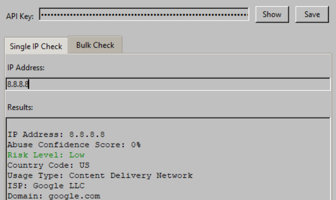

# AbuseIPDB Win98 IP Tool

A Windows 98 styled tool for checking IP addresses against the AbuseIPDB database. Input a CSV list of IP addresses (one per line) and receive a CSV-formatted report with abuse information, country code, ISP, and domain details for each IP checked.



## Features

- Retro Windows 98 user interface
- Bulk IP and single IP checking against AbuseIPDB
- CSV export with detailed abuse information

## Requirements

You will need an API key from the AbuseIP Database, available for free at [https://www.abuseipdb.com/account/api](https://www.abuseipdb.com/account/api).

## Setup

1. Clone the repository:
   ```
   git clone https://github.com/lewiswigmore/abuseipdb-98.git
   cd abuseipdb-98
   ```

2. Install the required dependencies:
   ```
   pip install -r requirements.txt
   ```

3. Run the application:
   ```
   python abuseipdb98.py
   ```

## Quick Start Guide

1. **Launch the application** - Run `python abuseipdb98.py`
2. **Enter your API key** - You can get one from [AbuseIPDB](https://www.abuseipdb.com/account/api)
3. **Single IP Check** - Enter an IP address in the "Single IP" tab and click "Check IP" 
4. **Bulk IP Check** - Go to the "Bulk Check" tab, select a CSV file with one IP per line, choose an export location, and click "Start Check"
5. **Create Desktop Shortcut** - For easy access, click "Create Desktop Shortcut" button

## Mentions

- [AbuseIPDB](https://abuseipdb.com) - For providing the API
- [98.css](https://github.com/jdan/98.css) - For the Windows 98 design system
- [PoshGUI](https://poshgui.com) - For the original PowerShell GUI
- [Potatrix](https://github.com/Potatrix) - For contributions
- [AdmiralSYN-ACKbar](https://github.com/AdmiralSYN-ACKbar) - For the original bulkcheck project

## Note

Original project can be found at [AdmiralSYN-ACKbar/bulkcheck](https://github.com/AdmiralSYN-ACKbar/bulkcheck).
